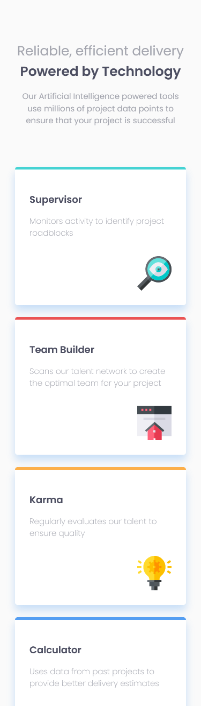
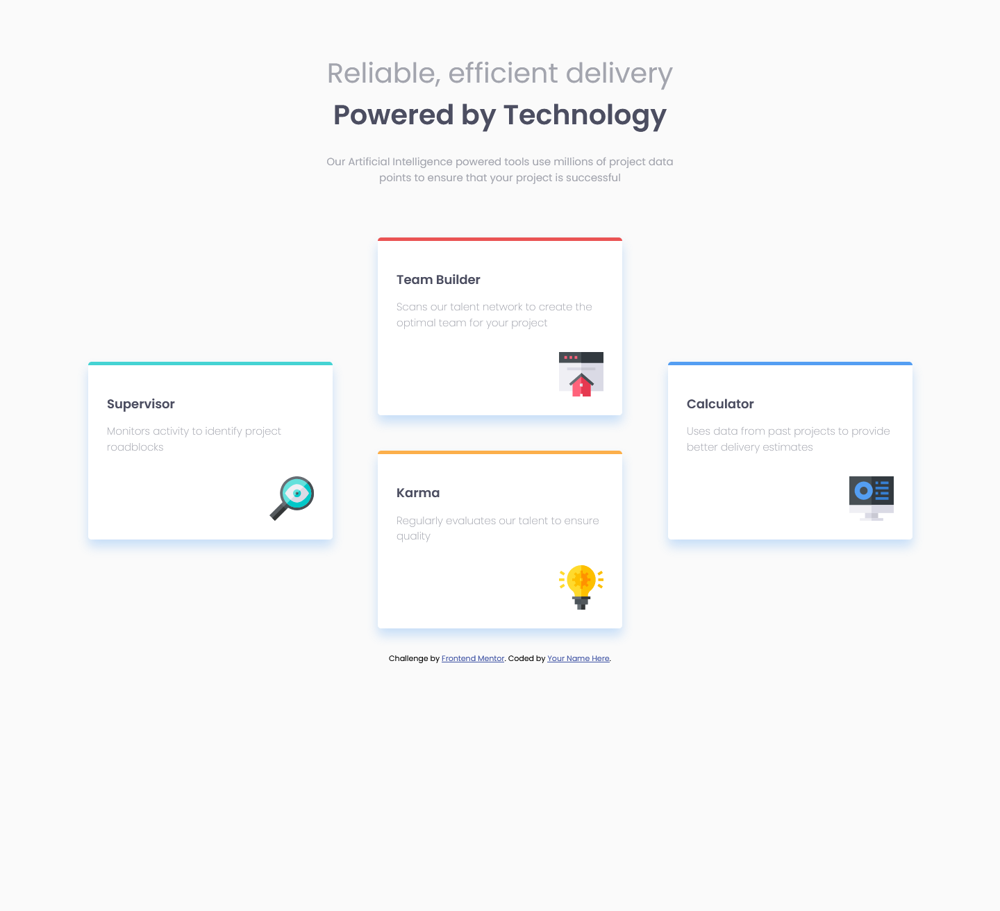

# Frontend Mentor - Four card feature section


## Deploying your project

As mentioned above, there are many ways to host your project for free. Our recommended hosts are:

- [GitHub Pages](https://pages.github.com/)
- [Vercel](https://vercel.com/)
- [Netlify](https://www.netlify.com/)

You can host your site using one of these solutions or any of our other trusted providers. [Read more about our recommended and trusted hosts](https://medium.com/frontend-mentor/frontend-mentor-trusted-hosting-providers-bf000dfebe).

## Got feedback for us?

We love receiving feedback! We're always looking to improve our challenges and our platform. So if you have anything you'd like to mention, please email hi[at]frontendmentor[dot]io.

This challenge is completely free. Please share it with anyone who will find it useful for practice.

# Frontend Mentor - Four card feature section solution

This is a solution to the [Four card feature section challenge on Frontend Mentor](https://www.frontendmentor.io/challenges/four-card-feature-section-weK1eFYK). Frontend Mentor challenges help you improve your coding skills by building realistic projects. 

## Table of contents

- [Overview](#overview)
  - [The challenge](#the-challenge)
  - [Screenshot](#screenshot)
  - [Links](#links)
- [My process](#my-process)
  - [Built with](#built-with)
  - [What I learned](#what-i-learned)
  - [Continued development](#continued-development)
- [Author](#author)
  
## Overview
Se trata de cuatro tarjetas que están alineadas en bloque en diseño móvil e intercaladas en estilo escritorio.

### The challenge
El reto está dividido, claramente en dos partes.
Una en la que hay una disposición de un columna
y la otra con grid en 3 columnas y dos filas.

### Screenshot




### Links

- Solution URL: [Add solution URL here](https://github.com/juan-mentor/four-card-feature-section-master.git)
- Live Site URL: [Add live site URL here](https://juan-mentor.github.io/four-feature-section-master/)

## My process
Este es mi primer proyecto con Css grid, que ha resultado un tanto decepcionante, porque no he sabido recolocar los items como me pedían en el reto.

Así como en Flexbox, tengo más claro que width o flex-basis deben tener los items, en grid no tengo claro como tengo que hacerlo.

Por lo demás ha ido bien. Primero he empezado por móvil, del que no he tenido problemas y luego he querido hacer dos consultas de medios. Por que creí necesario hacer una transición entre una columna (móvil), dos columnas y tres columnas (desktop).

### Built with

- Semantic HTML5 markup
- CSS custom properties
- Flexbox
- CSS Grid
- Mobile-first workflow

### What I learned

He aprendido a como utilizar box-shadow de forma correcta. Al principio no atinaba con el color y era porque tenía una opcidad grande, además de un difuminado.

```css
.card {
  box-shadow: 0 10px 15px hsla(212, 86%, 64%, 0.3);
}
```

### Continued development
Me gustaría seguir ampliando sobre Css grid, al parecer no se como alinear sus elementos hijos ni verticalmente, ni horizontalmente.

## Author

- Frontend Mentor - [@yjuan-mentor](https://www.frontendmentor.io/profile/juan-mentor)
